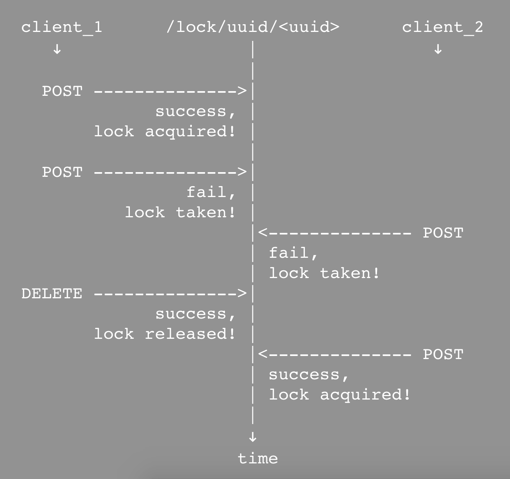
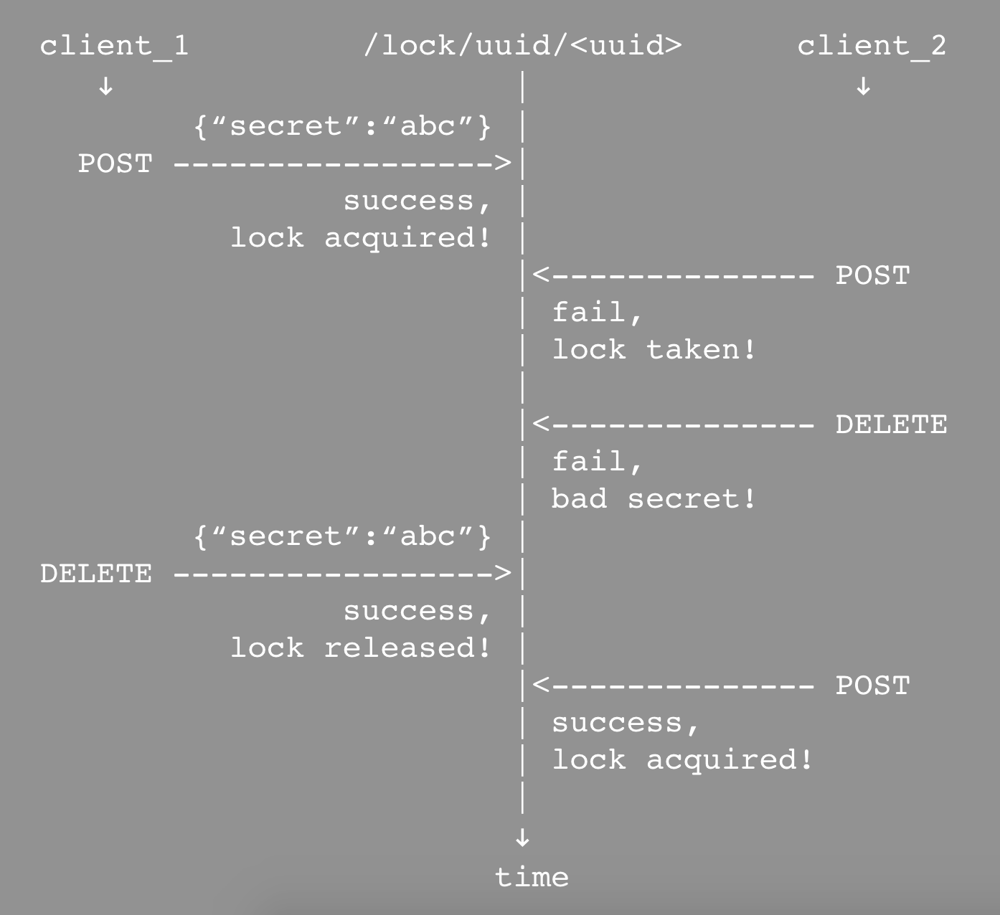

# Introduction

Welcome to the Locklock documentation!

The easiest was to describe Locklock is Lock-as-a-Service - a REST API for simple distributed locks.

Acquiring a lock is as easy as `POST`ing to an endpoint, and releasing that same lock is done by `DELETE`ing that same endpoint:



When accessed by multiple clients at the same time, locklock guarantees only one of the incoming requests will acquire the specified lock.

Locklock was designed to be instantly usable and is accessible as a free public service at `https://public.locklock.io/v1/api`.

The free version of Locklock supports [UUIDs](https://en.wikipedia.org/wiki/Universally_unique_identifier) as lock identifiers as it is straightforward to ensure uniqueness of these identifiers across multiple users and avoid namespace collisions. Paid accounts support a range of additional functionality, including custom lock identifiers in your own namespace (see below for more information).

## Motivation for Locklock

We built Locklock mainly because simple patterns of distributed locking kept coming up in our system designs.

The common use case is ensuring multiple components of a distributed system take turns accessing a shared resource.

A special case of that is guaranteeing a particular operation takes place at most once. For example, some AWS services guarantee [at-least-once delivery](https://aws.amazon.com/sns/faqs/#Reliability), but sometimes consequences of these events need to execute *exactly* once. To accomplish this, simply acquire a lock for the identifier representing the originating event once and don't release it.

Our secondary motivation was to unify locking logic across components of a distributed system, which may be written in different programming languages. By using Locklock, they only need to know how to communicate with a simple REST API.

# Quickstart

```shell
curl -X POST \
  https://public.locklock.io/v1/api/lock/uuid/180da65c-cf80-4997-8574-0c0801817d6f
```

Acquiring a lock is as simple as:

`POST https://public.locklock.io/v1/api/lock/uuid/<uuid>`

```shell
curl -X DELETE \
  https://public.locklock.io/v1/api/lock/uuid/180da65c-cf80-4997-8574-0c0801817d6f
```

Releasing an acquired lock is accomplished by:

`DELETE https://public.locklock.io/v1/api/lock/uuid/<uuid>`

# Usage

```shell
curl -X POST \
    -d '{"secret":"super-secret", "expires_in": 300}' \
    -H "Content-Type: application/json" \
    https://public.locklock.io/v1/api/lock/uuid/180da65c-cf80-4997-8574-0c0801817d6f
```

The user may specify two POST parameters:

- `expires_in`: specifies the lock expiration time in seconds (default: 30 days)
- `secret`: specifies a secret that is required to release the lock

```shell
curl -X DELETE \
    -d '{"secret":"super-secret"}' \
    -H "Content-Type: application/json" \
    https://public.locklock.io/v1/api/lock/uuid/180da65c-cf80-4997-8574-0c0801817d6f
```

If a `secret` is provided when acquiring the lock, that same `secret` is required to release the lock (unless the lock expires). This may be useful in situations where multiple clients have knowledge of the lock id:



# Pro accounts

For users with production-level requirements, paid Pro accounts are available. Please contact <a href='mailto:support@locklock.io'>support@locklock.io</a> for more information.

Feature | Developer | Pro
--------- | ----------- | -----------
Access to public API | + | +
UUID-named locks (`/lock/uuid/<uuid>`) | + | +
Custom subdomain | - | +
Custom (non-UUID) lock names (`/lock/key/<custom-name>`) | - | +
Attach data payload to lock | - | +
API key | - | +
Higher throttling limits | - | +
Custom AWS regions | - | +
Enhanced support | - | +
